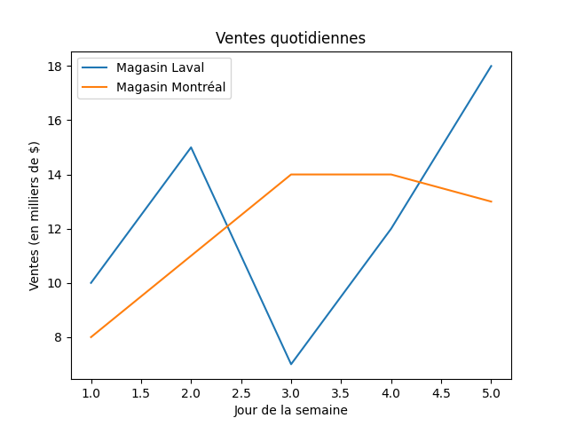
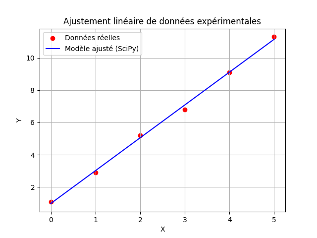

+++
title = "Matplotlib"
type = "chapter"
draft = false
weight = 8
+++

Avoir des tableaux NumPy pleins de chiffres, c'est utile pour calculer, mais c'est beaucoup plus parlant lorsqu'on peut transformer ces données en graphiques. En Python, la bibliothèque standard pour dessiner des graphiques s'appelle Matplotlib.

Pour nos besoins, on utilise un sous-module spécifique de cette bibliothèque appelé Pyplot.

## Utilisation de Matplotlib

Tous les graphiques vus en classe utilisent cette même libraire:

```python
import matplotlib as plt
```

## Fonctions utiles


### plt.plot()

Pour tracer une ligne dans un graphique 2d, il suffit de donner les données en x et en y dans leurs numpy arrays.

```python
x = np.array([1, 2, 3, 4, 5])
y = np.array([2, 4, 6, 8, 10])

# 1. On trace les données
plt.plot(x, y)

# 2. On affiche le graphique à l'écran
plt.show()
```
Si on appelle plt.plot() plusieurs fois de suite avant d'appeler plt.show(), Matplotlib va superposer les lignes sur le même graphique en changeant automatiquement la couleur.

Pour savoir quelle ligne correspond à quoi, on utilise l'argument label et la fonction plt.legend().

```python
jours = np.array([1, 2, 3, 4, 5])
magasin_A = np.array([10, 15, 7, 12, 18])
magasin_B = np.array([8, 11, 14, 14, 13])

# On trace les deux lignes avec un nom (label)
plt.plot(jours, magasin_A, label="Magasin Laval")
plt.plot(jours, magasin_B, label="Magasin Montréal")

# On configure le reste du graphique
plt.title("Ventes quotidiennes")
plt.xlabel("Jour de la semaine")
plt.ylabel("Ventes (en milliers de $)")

# L'étape cruciale pour afficher la petite boîte explicative :
plt.legend()

# C'est ce qui affiche le graphique à la fin
plt.show()
```




### plt.scatter()

Contrairement à plt.plot() qui relie automatiquement les coordonnées par une ligne, la méthode plt.scatter(x, y) trace chaque couple de données sous la forme d'un point isolé. C'est la méthode à privilégier lorsqu'on affiche des mesures expérimentales ou des données brutes récoltées.

```python
import matplotlib.pyplot as plt
import numpy as np

# Génération de données fictives (ex: heures d'étude vs note obtenue)
heures = np.array([1, 2, 3, 5, 6, 7, 9])
notes = np.array([52, 58, 65, 72, 76, 89, 95])

# Tracer le nuage de points
plt.scatter(heures, notes, color="black", label="Données observées")

# Configuration du graphique
plt.title("Relation entre les heures d'étude et la note")
plt.xlabel("Heures d'étude")
plt.ylabel("Note obtenue (%)")
plt.grid(True)
plt.legend()

plt.show()
```

### Régression (curve fit)

L'ajustement de courbe consiste à trouver les paramètres d'une fonction mathématique théorique qui passe le plus près possible de nos points expérimentaux. En Python, cette opération est gérée par la fonction curve_fit du sous-module optimize de la bibliothèque SciPy.

Pour l'utiliser, la démarche se fait en trois étapes :
 - 1 Définir une fonction Python qui représente le modèle mathématique (ex: une droite, une parabole).
 - 2 Passer cette fonction et nos données à curve_fit().
 - 3 Récupérer les coefficients optimisés trouvés par l'algorithme.
 
 
 #### Exemple pratique : Ajustement linéaire (y = ax + b)
 
 Imaginons que nos points semblent suivre une tendance linéaire. Nous voulons trouver les valeurs optimales de la pente a et de l'ordonnée à l'origine b.

 ```python
import numpy as np
import matplotlib.pyplot as plt
from scipy.optimize import curve_fit

# 1. Nos données expérimentales (nuage de points)
x_data = np.array([0, 1, 2, 3, 4, 5])
y_data = np.array([1.1, 2.9, 5.2, 6.8, 9.1, 11.3])

# 2. Définition du modèle mathématique théorique
def modele_lineaire(x, a, b):
    return a * x + b

# 3. Calcul de l'ajustement
# curve_fit retourne deux variables. La première (popt) contient les paramètres optimisés.
popt, pcov = curve_fit(modele_lineaire, x_data, y_data)

# Extraction des coefficients calculés
a_optimise, b_optimise = popt

print(f"Équation trouvée : y = {a_optimise:.2f} * x + {b_optimise:.2f}")
# Équation trouvée : y = 2.03 * x + 0.98
 ```

Une fois les paramètres optimisés obtenus, on peut superposer le nuage de points initial et la droite théorique calculée pour valider visuellement notre modèle. 

```python
x_modele = np.linspace(0, 5, 100)

# modele_lineaire est la fonction appliquée aux 100 points dans x_modele
y_modele = modele_lineaire(x_modele, a_optimise, b_optimise)

# 5. Affichage superposé
# nuage de points pour les vraies données
plt.scatter(x_data, y_data, color="red", label="Données réelles")

# courbe (ligne brisée) de régression
plt.plot(x_modele, y_modele, color="blue", label="Modèle ajusté (SciPy)")

plt.title("Ajustement linéaire de données expérimentales")
plt.xlabel("X")
plt.ylabel("Y")

#ajoute une grille quadrillée au graphique
plt.grid(True)
plt.legend()

#permet d'enregistrer le graphique
plt.savefig('graph2.png') 

plt.show()
```

